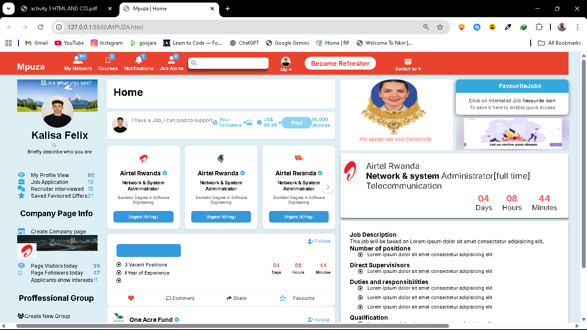

# Activity 3: Html and Css

##  Preview

##  Project Objective
[cite_start]The goal of this assignment is to translate a UI/UX mockup into real code using HTML and CSS[cite: 1, 10]. [cite_start]The focus is on structure, layout, spacing, typography, and visual accuracy rather than functionality[cite: 11].

##  Technologies Used
* [cite_start]**HTML5**: Used for the structural layout[cite: 15].
* [cite_start]**CSS3**: Used for styling, including Flexbox for centering and box-shadows for depth[cite: 16].
* [cite_start]**Font Awesome**: Used for the email, password, and logo icons to match the mockup[cite: 1, 4].
* [cite_start]**Google Fonts**: To ensure clean, professional typography[cite: 11].

##  Features Recreated
* [cite_start]**Header & Footer**: Replicated the red top-bar and blue bottom-bar structure[cite: 1].
* [cite_start]**Custom Button**: A rounded "Sign In" button with the specific blue color theme[cite: 8].

##  How to View
1. Clone the repository.
2. Open `index.html` in any modern web browser.

##  Submission Details
* **Student Name**: IRADUKUNDA Kevin
* [cite_start]**Deadline**: 09/02/2026 10:00 PM
* [cite_start]**Instructor Invitation**: ydiasniyonshuti@yahoo.fr
